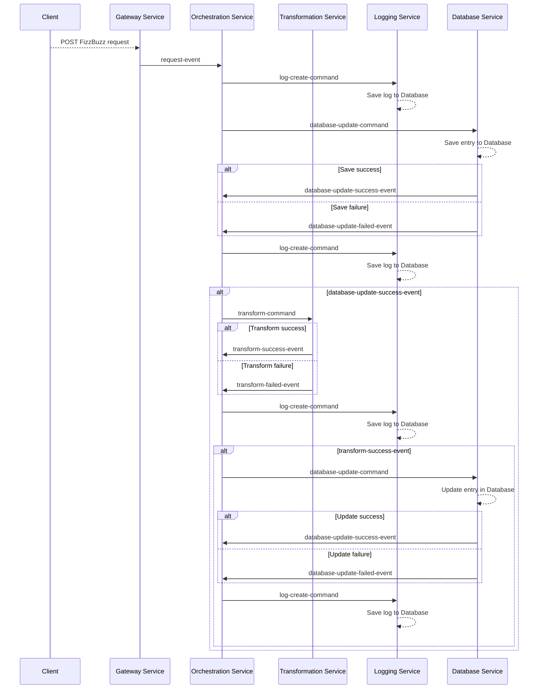
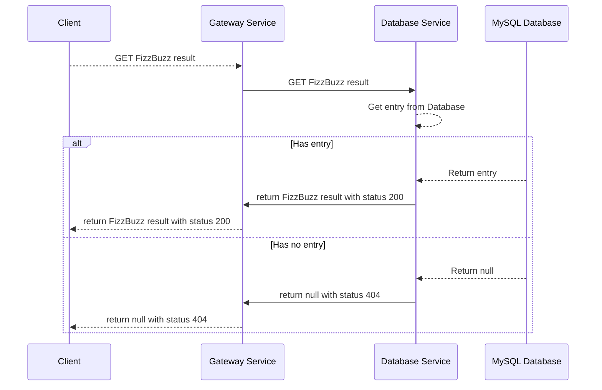
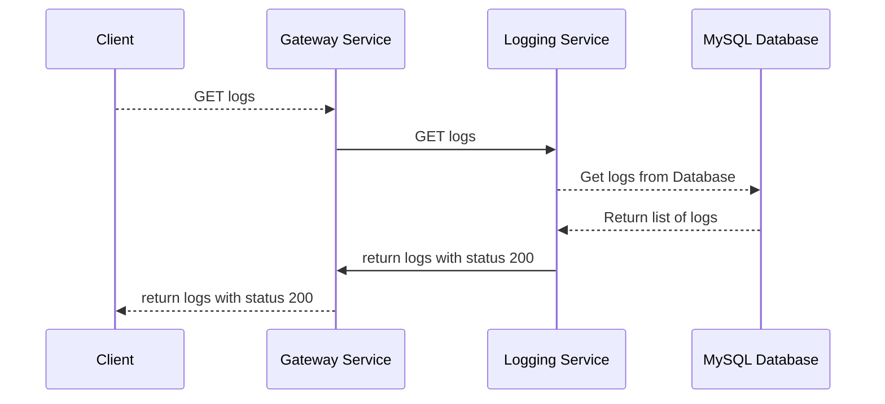

# FizzBuzz Microservices Edition

*I don't remember why and how i created this.*

## About

A simple FizzBuzz microservices solution, using Kotlin, Spring, Apache Kafka, MySQL and Docker.
Inspired by the [FizzBuzzEnterpriseEdition](https://github.com/EnterpriseQualityCoding/FizzBuzzEnterpriseEdition).

## Overview

While there are a lot of FizzBuzz solutions out there, most of them unfortunately do not use microservices.
 The general rules are as following:

- If number is divisible by 3 return Fizz
- If number is divisible by 5 return Buzz
- If number is divisible by 3 and 5 return FizzBuzz

## Infrastructure

The solution contains multiple modules, each of them is a microservice, that can be deployed, and duplicated for
reliability.

- **core:** Contains general settings, exceptions and DTOs that are used in multiple modules.
- **fizzbuzz-database-service:** Saves and updates FizzBuzz requests.
- **fizzbuzz-gateway:** All requests are sent through the gateway, uses basic-auth, for simplicity.
- **fizzbuzz-logging-service:** Receives and saves logs of FizzBuzz requests.
- **fizzbuzz-orchestration-service:** Receives events from the other microservices and sends commands.
- **fizzbuzz-transform-service:** Will receive numbers and apply the FizzBuzz rules.

Logs, FizzBuzz requests and User-Details get saved in different DBs, communication between the microservices are via
Apache Kafka, unless it is to receive results or logs.

## Workflows

There are 3 workflows, depending on the request sent by the user.

### FizzBuzz request

This workflow will be running when a user wishes to get a FizzBuzz result for any number, the communication between the
microservices will run via Apache Kafka.
 Databases are not part of the diagram, else it would get too big.

### FizzBuzz result

This workflow will run to return the FizzBuzz result, communication between microservices is via REST.

### Logging request

This workflow will run to return logs, communication between microservices is via REST.

## Prerequisites

## Preparations

## Run

### Authentication

### Send a FizzBuzz request

### Get a FizzBuzz result

### See the logs

## Final words
