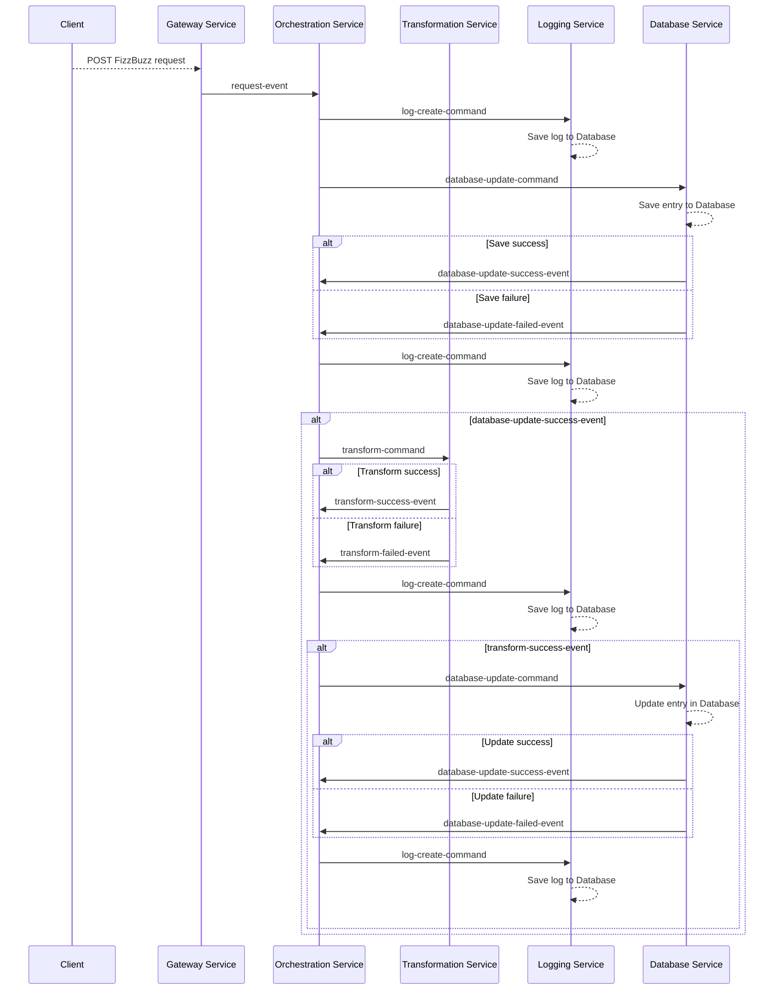
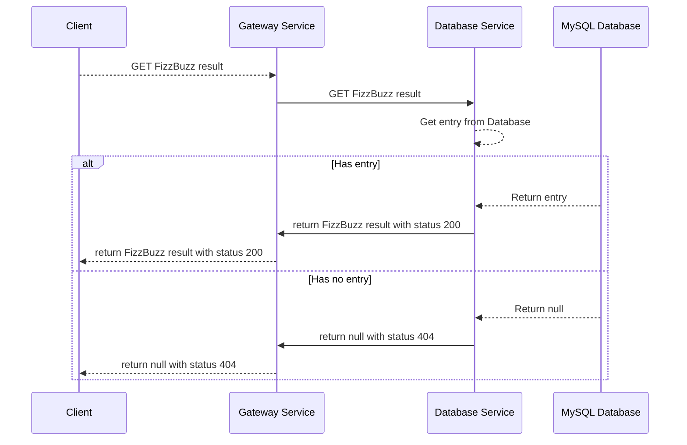
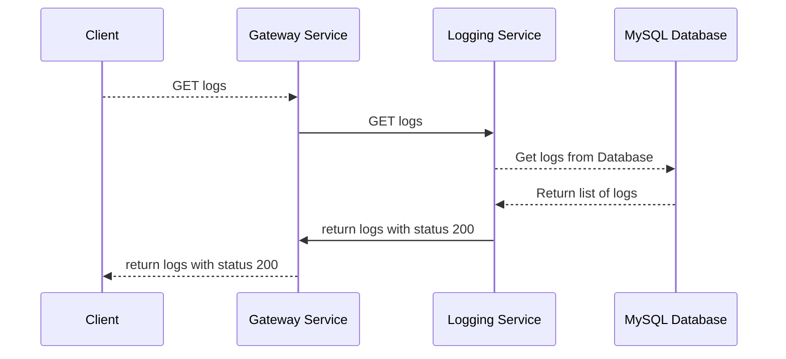

# FizzBuzz Microservices Edition

## About

## Overview

## Infrastructure

## Workflow

### FizzBuzz request

### FizzBuzz result

### Logging request

## Prerequisites

## Preparations

## Run

### Authentication

### Send a FizzBuzz request

### Get a FizzBuzz result

### See the logs

## Final words
